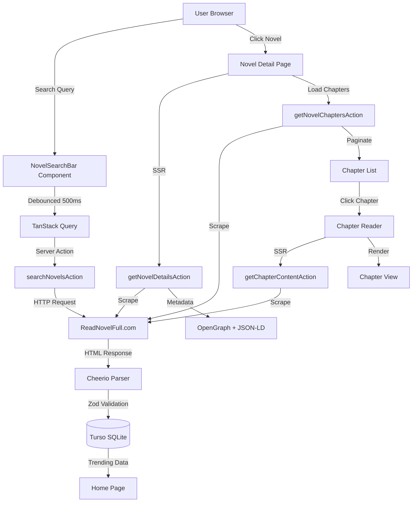

# SpitFire Novel Reader

> A full-stack web novel aggregation platform featuring real-time search, trending analytics, and an optimized reading experience powered by server-side web scraping.

## 🚀 Tech Stack & Engineering Decisions

### Frontend Architecture
- **Next.js 15 (App Router)** – Leverages React Server Components for optimal performance. Novel detail pages are statically generated at runtime with dynamic metadata injection for SEO.
- **React 19** – Uses concurrent features and Suspense boundaries for graceful loading states across paginated chapter lists.
- **TypeScript 5** – Strict type checking across the entire codebase with Drizzle ORM type inference for compile-time database safety.

### Backend & Data Layer
- **Next.js Server Actions** – Used for all data mutations and scraping operations. Input validation occurs at the server boundary using Zod schemas (e.g., `KeywordSchema` in `search-novel.ts`).
- **Turso (LibSQL)** – Distributed SQLite database hosted on Turso's edge network. Chosen for low-latency reads and automatic replication across regions.
- **Drizzle ORM** – Type-safe query builder with zero-cost abstractions. The schema (`lib/schema.ts`) uses SQLite's `datetime('now')` for automatic timestamp management.

### State Management & Data Fetching
- **TanStack Query (React Query)** – Manages server state with intelligent caching. Search queries use a 500ms debounce hook to prevent API spam. Chapter lists have a 5-minute `staleTime` since they rarely change.
- **Client-Side Debouncing** – Custom `useDebounce` hook reduces external API calls during live search by batching user input.

### UI & Styling
- **Tailwind CSS 4** – Utility-first styling with CSS variables for theme switching. Custom gradient backgrounds applied via `from-[color] to-[color]` syntax.
- **Radix UI** – Accessible component primitives (Dialog, Popover, Command) with full keyboard navigation support.
- **Framer Motion** – Used for staggered list animations in chapter pagination (`staggerChildren: 0.03` for smooth sequential reveals).
- **shadcn/ui** – Pre-built component library built on Radix UI, customized via `components.json`.

### Data Source & Scraping
- **Axios + Cheerio** – Server-side HTML parsing of external novel sources. Implements retry logic and 404 handling in `get-novel-page.ts` and `get-chapter-content.ts`.
- **Zod Validation** – All scraped data passes through strict schemas before insertion. Prevents malformed links and ensures relative path formats (`startsWith("/")` checks).

### SEO & Metadata
- **Dynamic Metadata Generation** – Each novel page generates OpenGraph tags, Twitter Cards, and JSON-LD structured data at build time.
- **Sitemap Generation** – `app/sitemap.ts` dynamically includes trending novels for better indexing.
- **Image Optimization** – Next.js `<Image>` component with `remotePatterns` configured for `img.readnovelfull.com`.

## ✨ Key Features

- **Debounced Live Search** – Autocomplete search with 500ms debounce and TanStack Query caching to minimize API load.
- **Trending & Recent Novels** – Tracks search frequency and timestamps in SQLite. Uses `ORDER BY search_count DESC, last_searched DESC` for popularity ranking.
- **Pagination & Lazy Loading** – Chapter lists paginated at 50 items per page with animated page transitions via Framer Motion.
- **Chapter Navigation** – Previous/Next buttons with disabled states when at boundaries. Home button always available.
- **Dark/Light Theme** – Persistent theme switching via `next-themes` with system preference detection.
- **SEO Optimization** – Structured data (Book schema), OpenGraph tags, and dynamic meta descriptions per novel.
- **Error Boundaries** – Server Actions throw typed errors that are caught and displayed with user-friendly messages.

## 🏗️ System Architecture



### Data Flow
1. **Search Flow**: User input → Debounce → React Query → Server Action → Axios/Cheerio → SQLite (upsert with `search_count + 1`).
2. **Novel Details**: Server Component fetches data at request time → Generates metadata → Hydrates client components for interactivity.
3. **Chapter Rendering**: Scrapes HTML → Parses paragraphs → Cleans text → Renders with Tailwind typography classes.

### Scraping Architecture
- All scraping operations use relative paths (`/novel/[slug]`) to avoid hardcoded domains.
- Server Actions validate inputs with Zod before making external requests.
- Errors are caught and logged server-side; generic messages returned to clients.

## 🔧 Setup & Installation

### Prerequisites
- Node.js 20+
- pnpm (recommended) or npm

### Environment Variables
Create a `.env` file in the root directory:

```env
# Turso Database Configuration
TURSO_DB_TOKEN=your_turso_auth_token_here

# Optional: Custom Base URL for metadata (defaults to Vercel deployment)
NEXT_PUBLIC_BASE_URL=https://your-domain.com
```

**How to get `TURSO_DB_TOKEN`:**
1. Sign up at [turso.tech](https://turso.tech)
2. Install Turso CLI: `curl -sSfL https://get.tur.so/install.sh | bash`
3. Create a new database: `turso db create web-novel-project`
4. Generate a token: `turso db tokens create web-novel-project`
5. Copy the token to your `.env` file
6. The database URL is already configured in `lib/db.ts` and `drizzle.config.ts`

### Installation Steps

```bash
# Install dependencies
pnpm install

# Push database schema to Turso
pnpm drizzle-kit push

# Run development server
pnpm dev
```

Open [http://localhost:3000](http://localhost:3000) to view the application.

### Build for Production

```bash
pnpm build
pnpm start
```

## 🔮 Future Improvements / Known Issues

### Missing Features
- **No Unit Tests** – Add Jest + React Testing Library for component testing and Playwright for E2E tests.
- **No API Rate Limiting** – External scraping source could block requests. Implement caching layer or rotate proxies.
- **No User Authentication** – Currently no user accounts or reading history persistence beyond search tracking.
- **No Mobile-Optimized Reader** – Chapter view needs better typography scaling and gesture navigation for mobile devices.

### Technical Debt
- **Fragile Scraping** – Dependent on external site's HTML structure. If selectors change, scraping breaks. Consider API alternatives or implementing fallback selectors to handle DOM structure changes.
- **No Error Recovery** – Failed scrapes show generic errors. Add retry logic with exponential backoff.
- **Missing Loading States** – Some components lack Suspense boundaries, causing layout shift during data fetching.
- **No Performance Monitoring** – Add Vercel Analytics or Sentry for tracking Core Web Vitals and scraping failures.

### Potential Enhancements
- **Reading Progress Tracking** – Store last-read chapter per novel in local storage or user accounts.
- **Offline Support** – Implement Service Worker for PWA capabilities and offline chapter access.
- **Advanced Search Filters** – Add genre, status (completed/ongoing), and rating filters to search.
- **Comment System** – Allow users to discuss novels and chapters.
- **Multi-Source Aggregation** – Scrape from multiple novel sites to increase content availability.

---

**Note:** This project demonstrates full-stack TypeScript development with modern React patterns, server-side data handling, and production-grade architecture decisions. The scraping approach showcases creative problem-solving for content aggregation, though a production system would ideally use official APIs.
